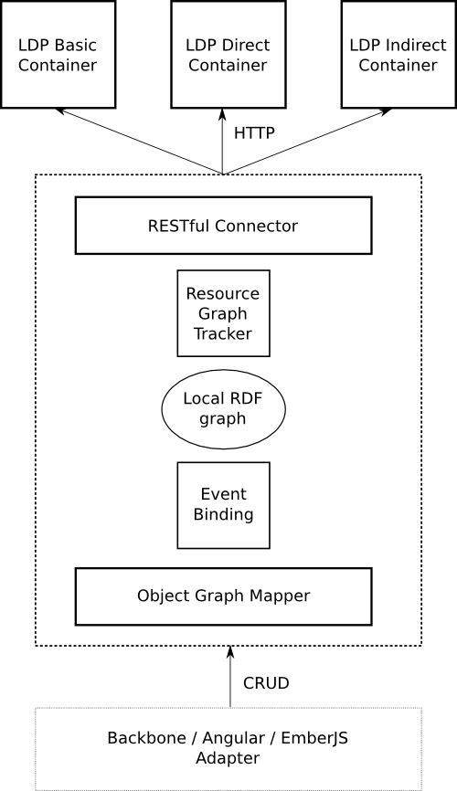

LDP JS Client
=============

The goal of this project is the creation of a JavaScript client library that can be used to build complex JavaScript applications backed by LDP resources.

The library should work as an intermediate component between the data layer of the application and the remote LDP resources retrieved from the web. It should be possible to integrate the library with different JavaScript frameworks like Backbone.JS or Angular.JS to provide a full blown solution for the construction of JavaScript client applications.

Some of the design goals of this project are:

- Simplify the interaction with remote LDP resources and containers, making it easy to retrieve, create and discover LDP resources, taking into account the security restrictions on those resources.
- Provide a way to transform the remote RDF graphs extracted from remote LDP resources into domain objects that can be used in the data layer of the application.
- Map CRUD operations over domain objects into the appropriate HTTP requests to the remote LDP resources backing the domain objects.
- Trigger the required events when domain objects are manipulated.

The main problem the library must solve is the mapping from LDP resources into domain objects and from CRUD operations over domain objects into HTTP operations over LDP resources.
LDP resources can contain RDF graphs with a number of RDF resources from different vocabularies. When this graph has been retrieved by the client it could transformed into an arbitrary number of domain objects encapsulating a subset of the triples retrieved from the LDP resource and some operations over those triples.
This is a change from traditional JSON APIs where there is usually a 1:1 correspondence between resources and domain model objects.
Any modification of domain objects through a CRUD operation requires an equivalent HTTP operation on the remote LDP resource to keep the state of the resource in sync with the local state of the application.
Another related problem is the creation of new domain objects that need to be persisted into a compatible LDP container if they are going to be stored as a new resource or modifying the state of a LDP resource where the triples for the new domain object are inserted.

Architecture
------------

The following diagram shows a possible high level design for the library including its main components:

- RESTful connector:

This component will take care of interacting with the remote LDP resources and containers using the HTTP protocol as it is specified in the LDP W3C recommendation.
It should hide all the details regarding the network transport of the resource representation as well as the discovery of meta-data about the resources.

- Local RDF graph:

RDF data extracted from the representations of the LDP resources will be merged into a single RDF graph stored locally into the client. Upper layers of the application will work directly with the local RDF graph without needing any direct knowledge of the underlying LDP resources.

- Resource graph tracker:

This component should record the source of any triple stored in the local application graph so it is possible to know what resources are in an inconsistent state when parts of the local RDF are modified due to CRUD operations.

- Object graph mapper:

This component should provide the basis for all the domain objects in the data layer. It should provide the right mechanism for the definition of the state of a domain object as a subgraph of the local RDF graph in a similar way as a ORM library works on top of a relational data base.
It should also provide basic support for CRUD operations on the domain object triples: modification and deletion, as well as the way of making these changes persistent in the remote LDP resources backing the object. It should also provide mechanisms for finding model objects in the RDF graph, arrange them in ordered collections and to create new objects and persist them in a remote LDP container.

- Event binding mechanism:

Modifications in any domain object or the underlying RDF graph should generate the appropriate set of events that can be used to update the state of other components or libraries to changes in the data model.
This mechanism should make it easy to integrate the library with other JavaScript application frameworks using some glue code.

